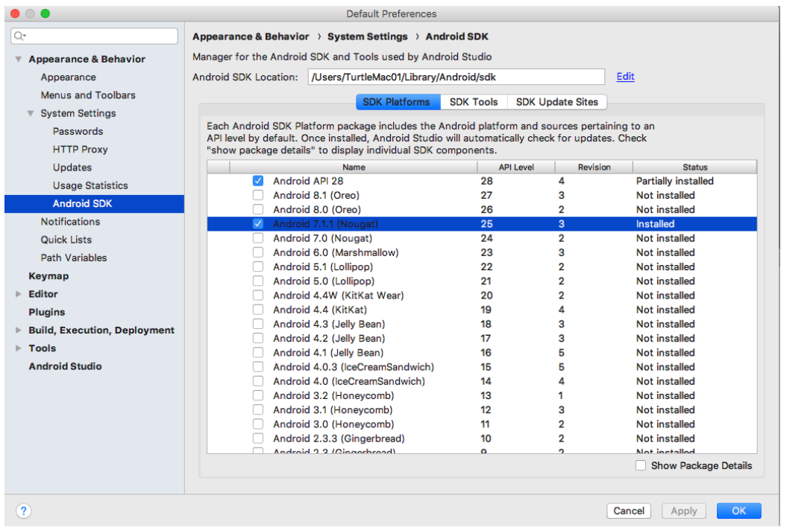
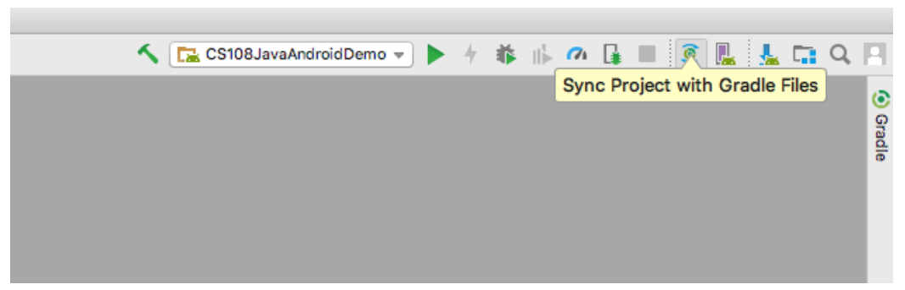
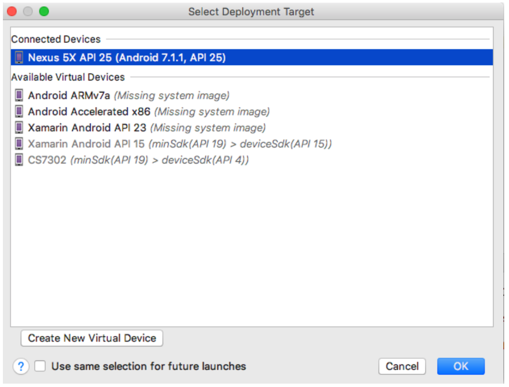
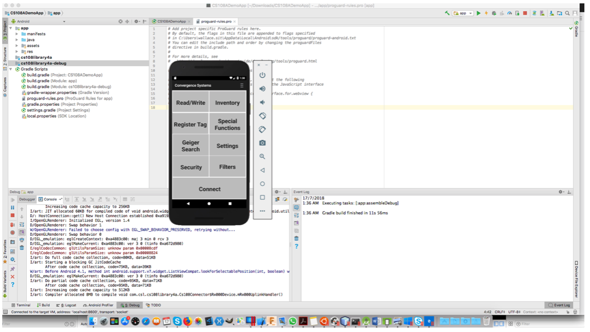

# CS108-Android-Java-App

CS108 Android Java Bluetooth Demo App and SDK

This application provides demonstrations to the programming interface made available on the CS108 handheld reader for configuring, controlling, and accessing the RFID reader. The development was based on the CS108 Java API.

[Product Information](https://www.convergence.com.hk/cs108/)
 

## Pre-requsite 

The development environment consists of the following:
- Android Studio 3.1.3 or above
- Java JDK 1.8
- Microsoft Windows 10 or Mac OSX or Linux

## Setting Up the Environment

You will need the Android SDK and related tools to get started on the development.  You can download the Android Studio from the Android developer site, which provides a complete process for obtaining the Android SDK and the development IDE.  

[Download Android Studio](https://developer.android.com/studio/)

Android Studio is available as a one single installer for both Mac and PC that also you to get ready in a one-step approach, which includes the Android SDK 

After running the Android Studio installer, you can open the CS108 Android Java demo package.  

With the existing demo code, it is required have Android SDK platform 25 installed.  You can achieve this by going to Tools->SDK Manager and select the Android 7.1.1 (Nougat) 25 from the this.  This will bring up the downloaded for getting the necessary platform SDK required.

 
You can go to Build->Make Project to rebuild the application.

After this, go to the menu bar and click on “Sync Project with Gradle Files” for enabling the building of the module.  Then, you can go to Run->Debug “app” to start debugging.

 
For debugging, you can select emulator for UI level debugging or select actual device for physical debugging on different features on the demo app.  
 

